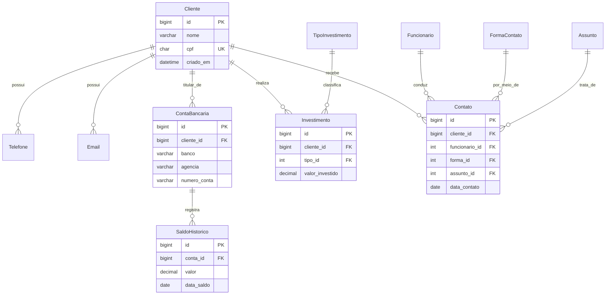

# SPEC TÉCNICA — Sistema XPTO Investimentos
## Caminho C: Full-Stack com ORM (Django 5 + PostgreSQL 16)
### Documento de especificação completa para desenvolvimento guiado por IA

**Versão:** 1.0
**Data:** 21/08/2026
**Base:** PRD C — Full-stack com ORM
**Objetivo do documento:** ser a única fonte de verdade para construir o projeto do zero até a implantação, incluindo planejamento, arquitetura, modelo de dados, fases de entrega e os prompts de IA que conduzem cada etapa.

---

## SUMÁRIO

1. Como usar este documento
2. Visão estratégica e escopo
3. Decisões de arquitetura (ADRs)
4. Arquitetura da solução — passo a passo
5. Estrutura de pastas do projeto
6. Modelo de dados completo (3FN)
7. Ambiente de desenvolvimento
8. Metodologia de desenvolvimento guiado por IA
9. Fases de entrega (Fase 0 → Fase 8)
10. Estratégia de migração das planilhas (ETL)
11. Estratégia de testes
12. Segurança e LGPD
13. Implantação (deploy) e operação
14. Critérios de aceite globais / Definition of Done
15. Glossário

---

## 1. COMO USAR ESTE DOCUMENTO

Este documento tem três leitores:

| Leitor | O que ele lê |
|---|---|
| **Você (product owner)** | Seções 2, 9, 14 — para decidir, acompanhar e aprovar |
| **A IA de desenvolvimento** (Claude Code, Cursor, Copilot) | Seções 3 a 12 — como contexto técnico e prompts |
| **Um desenvolvedor humano** (se houver) | Documento inteiro |

**Regra de ouro:** cada fase da Seção 9 só começa quando a fase anterior tiver todos os seus critérios de aceite marcados. Não pule fases — a Fase 0 e a Fase 1 são as que evitam 80% do retrabalho.

---

## 2. VISÃO ESTRATÉGICA E ESCOPO

### 2.1 O problema
A XPTO Investimentos gerencia clientes, investimentos e histórico de contatos em três planilhas Excel. Isso gera: duplicação de clientes, dados multivalorados em uma única célula, saldo tratado como atributo fixo (quando é histórico), ausência de integridade referencial (existe contato para cliente inexistente) e impossibilidade de análise confiável.

### 2.2 A solução
Um sistema web transacional com banco relacional normalizado até a 3FN, interface administrativa para operação diária, importador das planilhas legadas e API para futuras integrações.

### 2.3 Por que este caminho (pensamento estratégico)

| Alternativa | Por que não foi escolhida aqui |
|---|---|
| SQL puro | Entrega modelo, não entrega sistema usável |
| Low-code (Supabase) | Rápido, mas teto baixo de customização de regra de negócio |
| BI/dbt | Analítico, não transacional — não resolve o cadastro |

**Django foi escolhido porque:**
- O **Django Admin** gera as telas de CRUD automaticamente a partir do modelo de dados — você ganha um sistema operável sem escrever front-end.
- O **ORM + migrations** versiona a evolução do banco: a normalização fica documentada em código.
- É maduro, gratuito, com enorme base de documentação em português.
- Permite crescer depois para API REST (Django REST Framework) sem reescrever nada.

**Trade-off aceito:** curva de aprendizado de Python/Django maior que a de low-code. Mitigação: desenvolvimento guiado por IA (Seção 8) + Admin automático.

### 2.4 Escopo

**Dentro do escopo (v1.0):**
- Modelo de dados 3FN com 11 entidades
- CRUD completo via Django Admin, com inlines (telefones, e-mails, contas dentro do cliente)
- Autenticação e controle de acesso por grupo/papel
- Importador das 3 planilhas (comando de linha), com deduplicação, quebra de multivalorados e quarentena de órfãos
- Validação de CPF (algoritmo dos dígitos verificadores) e normalização de telefone
- Relatórios básicos: saldo atual por cliente, total investido por tipo, histórico de contatos por funcionário
- Trilha de auditoria (quem alterou o quê e quando)
- Testes automatizados
- Deploy em contêiner

**Fora do escopo (v1.0):**
- Portal do cliente final (autoatendimento)
- Integração com bancos ou B3
- App mobile
- Cálculo de rentabilidade/marcação a mercado
- Multi-tenant (múltiplas empresas no mesmo sistema)

### 2.5 Métricas de sucesso

| Métrica | Alvo |
|---|---|
| Registros das 3 planilhas migrados sem perda | 100% (órfãos registrados em quarentena, não descartados) |
| Violações de integridade referencial pós-carga | 0 |
| Clientes duplicados no banco | 0 |
| Cobertura de testes automatizados | ≥ 70% |
| Tempo de cadastro de um cliente completo pelo Admin | ≤ 3 minutos |
| `python manage.py check --deploy` sem erros críticos | Sim |

---

## 3. DECISÕES DE ARQUITETURA (ADRs)

Registro conciso das decisões técnicas e sua justificativa. Serve para você (e a IA) não reabrir discussões já resolvidas.

**ADR-01 — Chave primária substituta (surrogate), CPF como chave natural única.**
PK = `id` (BigAutoField gerado pelo banco). CPF recebe `unique=True`.
*Motivo:* evita propagar dado pessoal como FK em todas as tabelas; joins mais rápidos; resiliente a mudança de regra.

**ADR-02 — Saldo modelado como histórico ligado à conta bancária.**
Tabela `SaldoHistorico` com FK para `ContaBancaria`, com `unique_together = (conta, data_saldo)`.
*Motivo:* o enunciado apresenta "Saldo + Data do saldo" ao lado dos dados bancários; um cliente pode ter contas em bancos diferentes com saldos independentes.

**ADR-03 — Tabelas de domínio como entidades, não como `choices` fixas.**
`TipoInvestimento`, `FormaContato`, `Assunto` viram tabelas.
*Motivo:* a XPTO pode criar novos produtos/assuntos sem alterar código; e é o que a 3FN exige (elimina dependência transitiva).

**ADR-04 — `Funcionario` é entidade própria, não texto livre.**
*Motivo:* funcionário tem identidade, pode ganhar atributos (matrícula, e-mail, equipe) e permite relatórios por atendente.

**ADR-05 — Exclusão protegida em relações históricas.**
`on_delete=PROTECT` em Investimento e Contato; `CASCADE` apenas em dados dependentes do cliente (telefone, e-mail, conta).
*Motivo:* impedir que apagar um cliente destrua histórico contábil/regulatório.

**ADR-06 — Django Admin como interface principal da v1.**
*Motivo:* entrega valor imediato sem custo de front-end. Front-end customizado é evolução opcional (Fase 8).

**ADR-07 — PostgreSQL, não SQLite, desde o dia 1.**
*Motivo:* SQLite não reproduz o comportamento de constraints, tipos decimais e concorrência do ambiente real. Usar Docker para não precisar instalar Postgres na máquina.

**ADR-08 — Importação idempotente.**
Rodar o importador duas vezes não pode duplicar dados (uso de `get_or_create` / `update_or_create`).
*Motivo:* correções de planilha são frequentes; reimportar tem que ser seguro.

**ADR-09 — Configuração por variáveis de ambiente (12-Factor).**
Nada de senha ou `SECRET_KEY` em código.

**ADR-10 — Órfãos vão para quarentena, não são descartados nem criam cliente automaticamente.**
Tabela `ContatoQuarentena` guarda a linha bruta + motivo. Um humano decide.
*Motivo:* decisão de negócio, não técnica (caso Shiera Souza).

---

## 4. ARQUITETURA DA SOLUÇÃO — PASSO A PASSO

### 4.1 Visão em camadas

```
┌─────────────────────────────────────────────────────────┐
│  CAMADA DE APRESENTAÇÃO                                  │
│  • Django Admin (CRUD, inlines, filtros, busca)          │
│  • Views de relatório (templates HTML)                   │
│  • [opcional] API REST (Django REST Framework)           │
└───────────────────────┬─────────────────────────────────┘
                        │
┌───────────────────────▼─────────────────────────────────┐
│  CAMADA DE APLICAÇÃO / DOMÍNIO                           │
│  • Models (regras de integridade e validação)            │
│  • Services (regras de negócio: importação, dedupe)      │
│  • Validators (CPF, telefone, e-mail)                    │
│  • Management commands (importar_planilhas)              │
└───────────────────────┬─────────────────────────────────┘
                        │  Django ORM
┌───────────────────────▼─────────────────────────────────┐
│  CAMADA DE DADOS                                         │
│  • PostgreSQL 16 (11 tabelas em 3FN + auditoria)         │
│  • Migrations versionadas                                │
│  • Views/consultas analíticas                            │
└─────────────────────────────────────────────────────────┘

INFRAESTRUTURA: Docker Compose (app + db) → deploy em Render/Railway/VPS
```

### 4.2 Fluxo de dados — cadastro manual

```
Usuário → Django Admin → Form (validação) → Model.clean()
       → ORM → INSERT/UPDATE no PostgreSQL → Signal de auditoria → Log
```

### 4.3 Fluxo de dados — importação das planilhas

```
Excel (.xlsx)
   │  1. exportar/ler
   ▼
Leitura (pandas/openpyxl)
   │  2. normalizar (CPF, telefone, moeda, data)
   ▼
Camada de staging em memória (dicionários validados)
   │  3. deduplicar por CPF
   ▼
┌──────────────┬──────────────┬──────────────┐
│ Cliente      │ Investimento │ Contato      │
│ + Telefone   │ + Tipo       │ + Funcionário│
│ + Email      │              │ + Forma      │
│ + Conta      │              │ + Assunto    │
│ + Saldo      │              │              │
└──────────────┴──────────────┴──────┬───────┘
                                     │ CPF não existe?
                                     ▼
                            ContatoQuarentena + relatório
```

### 4.4 Passo a passo da construção (visão macro)

1. **Preparar ambiente** — Docker, Python, projeto Django, conexão com Postgres.
2. **Modelar** — escrever os `models.py` refletindo a 3FN; gerar migrations.
3. **Expor** — registrar no Admin com inlines, filtros e busca.
4. **Proteger** — grupos, permissões, validação de CPF, auditoria.
5. **Migrar** — comando de importação com dedupe e quarentena.
6. **Analisar** — consultas e telas de relatório.
7. **Testar** — testes de modelo, de validação e de importação.
8. **Implantar** — contêiner, variáveis de ambiente, backup.

Cada passo vira uma fase na Seção 9, com prompts de IA.

---

## 5. ESTRUTURA DE PASTAS DO PROJETO

```
xpto/
├── .env.example                # modelo de variáveis de ambiente
├── .gitignore
├── CLAUDE.md                   # contexto permanente para a IA (ver Seção 8)
├── docker-compose.yml
├── Dockerfile
├── requirements.txt
├── manage.py
├── README.md
│
├── config/                     # projeto Django (settings)
│   ├── __init__.py
│   ├── settings/
│   │   ├── base.py
│   │   ├── dev.py
│   │   └── prod.py
│   ├── urls.py
│   └── wsgi.py
│
├── apps/
│   ├── clientes/               # Cliente, Telefone, Email, ContaBancaria, SaldoHistorico
│   │   ├── models.py
│   │   ├── admin.py
│   │   ├── validators.py
│   │   ├── tests/
│   │   └── migrations/
│   │
│   ├── investimentos/          # TipoInvestimento, Investimento
│   │   ├── models.py
│   │   ├── admin.py
│   │   └── tests/
│   │
│   ├── relacionamento/         # Funcionario, FormaContato, Assunto, Contato, ContatoQuarentena
│   │   ├── models.py
│   │   ├── admin.py
│   │   └── tests/
│   │
│   ├── importacao/             # ETL das planilhas
│   │   ├── management/commands/importar_planilhas.py
│   │   ├── services.py
│   │   ├── parsers.py
│   │   └── tests/
│   │
│   └── relatorios/             # views e templates de relatório
│       ├── views.py
│       ├── queries.py
│       └── templates/
│
├── data/                       # planilhas de origem (NÃO versionar dados reais)
│   └── .gitkeep
│
└── docs/
    ├── SPEC.md                 # este documento
    ├── modelo-dados.md         # DBML + Mermaid
    └── decisoes/               # ADRs individuais
```

**Por que separar em `apps`:** cada app agrupa um contexto de negócio. Isso mantém arquivos pequenos, facilita testes e — importante para o desenvolvimento com IA — permite pedir mudanças com escopo delimitado ("altere apenas `apps/importacao`").

---

## 6. MODELO DE DADOS COMPLETO (3FN)

### 6.1 Entidades e cardinalidades

| Entidade | Descrição | Relações |
|---|---|---|
| Cliente | Pessoa física atendida | 1:N com Telefone, Email, ContaBancaria, Investimento, Contato |
| Telefone | Um número por linha (resolve 1FN) | N:1 Cliente |
| Email | Um endereço por linha (resolve 1FN) | N:1 Cliente |
| ContaBancaria | Banco + agência + conta | N:1 Cliente; 1:N SaldoHistorico |
| SaldoHistorico | Saldo em uma data | N:1 ContaBancaria |
| TipoInvestimento | Domínio: Ações, CDB, LCI... | 1:N Investimento |
| Investimento | Valor aplicado por cliente em um tipo | N:1 Cliente, N:1 TipoInvestimento |
| Funcionario | Atendente da XPTO | 1:N Contato |
| FormaContato | Domínio: Telefone, Email, WhatsApp, Pessoalmente | 1:N Contato |
| Assunto | Domínio: Revisão de Carteira, Rentabilidade... | 1:N Contato |
| Contato | Registro de atendimento | N:1 Cliente, Funcionario, FormaContato, Assunto |
| ContatoQuarentena | Linhas rejeitadas na importação | — |

### 6.2 Diagrama (Mermaid)



### 6.3 Models (código-fonte de referência)

```python
# apps/clientes/models.py
from django.db import models
from django.core.validators import RegexValidator
from .validators import validar_cpf


class Cliente(models.Model):
    nome = models.CharField("Nome completo", max_length=120)
    cpf = models.CharField(
        "CPF", max_length=14, unique=True,
        validators=[validar_cpf],
        help_text="Formato: 000.000.000-00",
    )
    cadastro_incompleto = models.BooleanField(default=False)
    criado_em = models.DateTimeField(auto_now_add=True)
    atualizado_em = models.DateTimeField(auto_now=True)

    class Meta:
        verbose_name = "Cliente"
        verbose_name_plural = "Clientes"
        ordering = ["nome"]
        indexes = [models.Index(fields=["cpf"])]

    def __str__(self):
        return f"{self.nome} ({self.cpf})"


class Telefone(models.Model):
    cliente = models.ForeignKey(Cliente, on_delete=models.CASCADE, related_name="telefones")
    numero = models.CharField(
        max_length=20,
        validators=[RegexValidator(r"^\(\d{2}\)\s?\d{4,5}-?\d{0,4}$", "Telefone inválido")],
    )
    principal = models.BooleanField(default=False)

    class Meta:
        constraints = [
            models.UniqueConstraint(fields=["cliente", "numero"], name="uq_telefone_cliente")
        ]

    def __str__(self):
        return self.numero


class Email(models.Model):
    cliente = models.ForeignKey(Cliente, on_delete=models.CASCADE, related_name="emails")
    endereco = models.EmailField(max_length=150)
    principal = models.BooleanField(default=False)

    class Meta:
        constraints = [
            models.UniqueConstraint(fields=["cliente", "endereco"], name="uq_email_cliente")
        ]

    def __str__(self):
        return self.endereco


class ContaBancaria(models.Model):
    cliente = models.ForeignKey(Cliente, on_delete=models.CASCADE, related_name="contas")
    banco = models.CharField(max_length=60)
    agencia = models.CharField(max_length=10)
    numero_conta = models.CharField(max_length=20)

    class Meta:
        verbose_name = "Conta bancária"
        verbose_name_plural = "Contas bancárias"
        constraints = [
            models.UniqueConstraint(
                fields=["banco", "agencia", "numero_conta"], name="uq_conta_banco"
            )
        ]

    def __str__(self):
        return f"{self.banco} • Ag. {self.agencia} • C/C {self.numero_conta}"

    @property
    def saldo_atual(self):
        return self.saldos.order_by("-data_saldo").first()


class SaldoHistorico(models.Model):
    conta = models.ForeignKey(ContaBancaria, on_delete=models.CASCADE, related_name="saldos")
    valor = models.DecimalField(max_digits=15, decimal_places=2)
    data_saldo = models.DateField()

    class Meta:
        verbose_name = "Saldo"
        verbose_name_plural = "Histórico de saldos"
        ordering = ["-data_saldo"]
        constraints = [
            models.UniqueConstraint(fields=["conta", "data_saldo"], name="uq_saldo_conta_data")
        ]

    def __str__(self):
        return f"R$ {self.valor} em {self.data_saldo:%d/%m/%Y}"
```

```python
# apps/investimentos/models.py
from django.db import models
from django.core.validators import MinValueValidator
from apps.clientes.models import Cliente


class TipoInvestimento(models.Model):
    nome = models.CharField(max_length=40, unique=True)
    ativo = models.BooleanField(default=True)

    class Meta:
        verbose_name = "Tipo de investimento"
        verbose_name_plural = "Tipos de investimento"
        ordering = ["nome"]

    def __str__(self):
        return self.nome


class Investimento(models.Model):
    cliente = models.ForeignKey(Cliente, on_delete=models.PROTECT, related_name="investimentos")
    tipo = models.ForeignKey(TipoInvestimento, on_delete=models.PROTECT, related_name="investimentos")
    valor_investido = models.DecimalField(
        max_digits=15, decimal_places=2, validators=[MinValueValidator(0)]
    )
    data_aplicacao = models.DateField(null=True, blank=True)

    class Meta:
        ordering = ["-valor_investido"]
        indexes = [models.Index(fields=["cliente", "tipo"])]

    def __str__(self):
        return f"{self.cliente.nome} — {self.tipo.nome}: R$ {self.valor_investido}"
```

```python
# apps/relacionamento/models.py
from django.db import models
from apps.clientes.models import Cliente


class Funcionario(models.Model):
    nome = models.CharField(max_length=80, unique=True)
    email_corporativo = models.EmailField(blank=True)
    ativo = models.BooleanField(default=True)

    class Meta:
        verbose_name = "Funcionário"
        verbose_name_plural = "Funcionários"
        ordering = ["nome"]

    def __str__(self):
        return self.nome


class FormaContato(models.Model):
    nome = models.CharField(max_length=30, unique=True)

    class Meta:
        verbose_name = "Forma de contato"
        verbose_name_plural = "Formas de contato"

    def __str__(self):
        return self.nome


class Assunto(models.Model):
    nome = models.CharField(max_length=60, unique=True)

    class Meta:
        ordering = ["nome"]

    def __str__(self):
        return self.nome


class Contato(models.Model):
    cliente = models.ForeignKey(Cliente, on_delete=models.PROTECT, related_name="contatos")
    funcionario = models.ForeignKey(Funcionario, on_delete=models.PROTECT, related_name="contatos")
    forma = models.ForeignKey(FormaContato, on_delete=models.PROTECT)
    assunto = models.ForeignKey(Assunto, on_delete=models.PROTECT)
    data_contato = models.DateField()
    observacao = models.TextField(blank=True)

    class Meta:
        ordering = ["-data_contato"]
        indexes = [models.Index(fields=["cliente", "-data_contato"])]

    def __str__(self):
        return f"{self.cliente.nome} — {self.assunto.nome} ({self.data_contato:%d/%m/%Y})"


class ContatoQuarentena(models.Model):
    """Linhas de contato que não puderam ser vinculadas a um cliente existente."""
    MOTIVOS = [
        ("CLIENTE_INEXISTENTE", "CPF não encontrado na base de clientes"),
        ("CPF_INVALIDO", "CPF com dígito verificador inválido"),
        ("DADO_FALTANTE", "Campo obrigatório ausente"),
    ]
    linha_origem = models.JSONField("Linha bruta da planilha")
    motivo = models.CharField(max_length=30, choices=MOTIVOS)
    detalhe = models.TextField(blank=True)
    importado_em = models.DateTimeField(auto_now_add=True)
    resolvido = models.BooleanField(default=False)

    class Meta:
        verbose_name = "Contato em quarentena"
        verbose_name_plural = "Contatos em quarentena"
```

### 6.4 Validador de CPF

```python
# apps/clientes/validators.py
import re
from django.core.exceptions import ValidationError


def validar_cpf(valor: str) -> None:
    numeros = re.sub(r"\D", "", valor or "")
    if len(numeros) != 11 or numeros == numeros[0] * 11:
        raise ValidationError("CPF inválido.")
    for i in (9, 10):
        soma = sum(int(numeros[j]) * ((i + 1) - j) for j in range(i))
        digito = (soma * 10 % 11) % 10
        if digito != int(numeros[i]):
            raise ValidationError("CPF inválido (dígito verificador).")


def formatar_cpf(valor: str) -> str:
    n = re.sub(r"\D", "", valor or "")
    return f"{n[:3]}.{n[3:6]}.{n[6:9]}-{n[9:]}" if len(n) == 11 else valor
```

> **Nota sobre os dados do enunciado:** os CPFs do exercício (111.222.333-44 etc.) são fictícios e **não passam** no dígito verificador. Solução: o importador deve ter uma flag `--sem-validacao-cpf` para o modo acadêmico, mantendo a validação ativa em produção.

---

## 7. AMBIENTE DE DESENVOLVIMENTO

### 7.1 Pré-requisitos

| Ferramenta | Versão | Para quê |
|---|---|---|
| Docker Desktop | 27.x | Roda o Postgres sem instalar nada |
| Python | 3.12 | Linguagem do Django |
| Git | 2.4x | Versionamento |
| VS Code | atual | Editor + extensão da IA |

### 7.2 `docker-compose.yml`

```yaml
services:
  db:
    image: postgres:16-alpine
    environment:
      POSTGRES_DB: xpto
      POSTGRES_USER: xpto
      POSTGRES_PASSWORD: ${DB_PASSWORD}
    ports: ["5432:5432"]
    volumes: ["pgdata:/var/lib/postgresql/data"]
    healthcheck:
      test: ["CMD-SHELL", "pg_isready -U xpto"]
      interval: 5s
      retries: 5

  web:
    build: .
    command: python manage.py runserver 0.0.0.0:8000
    volumes: [".:/app"]
    ports: ["8000:8000"]
    env_file: .env
    depends_on:
      db: {condition: service_healthy}

volumes:
  pgdata:
```

### 7.3 `requirements.txt`

```
Django==5.1.*
psycopg[binary]==3.2.*
python-decouple==3.8
openpyxl==3.1.*
pandas==2.2.*
django-auditlog==3.0.*
pytest==8.*
pytest-django==4.*
factory-boy==3.3.*
gunicorn==23.*
whitenoise==6.*
```

### 7.4 `.env.example`

```
DEBUG=True
SECRET_KEY=troque-esta-chave
DB_NAME=xpto
DB_USER=xpto
DB_PASSWORD=defina-uma-senha-forte
DB_HOST=db
DB_PORT=5432
ALLOWED_HOSTS=localhost,127.0.0.1
```

---

## 8. METODOLOGIA DE DESENVOLVIMENTO GUIADO POR IA

Esta é a seção que torna o projeto viável para alguém que não programa profissionalmente. A ideia: **você é a arquiteta e revisora; a IA é a executora.**

### 8.1 Princípios

1. **Contexto antes de código.** A IA só produz bem o que ela entende. Por isso existe o `CLAUDE.md`.
2. **Uma tarefa por prompt.** "Crie os models de clientes" é bom; "crie o sistema inteiro" é ruim.
3. **Sempre peça testes junto.** Código sem teste não tem como ser validado por quem não lê código.
4. **Commit por tarefa.** Se algo quebrar, você volta um passo, não o projeto inteiro.
5. **Revisão por comportamento, não por sintaxe.** Você valida rodando e vendo se faz o que deveria.
6. **A IA não decide arquitetura.** As decisões estão nos ADRs (Seção 3). Se a IA sugerir divergir, ela deve justificar e você decide.

### 8.2 O arquivo `CLAUDE.md` (contexto permanente)

Crie este arquivo na raiz do projeto. Toda IA de código o lê automaticamente ou pode ser apontada para ele.

```markdown
# Contexto do projeto — Sistema XPTO Investimentos

## O que é
Sistema de gestão de clientes, investimentos e contatos de uma consultoria
financeira. Substitui três planilhas Excel por um banco relacional em 3FN.

## Stack
Python 3.12 · Django 5.1 · PostgreSQL 16 · Docker · pytest

## Regras não negociáveis
- Modelo de dados permanece em 3FN. Não desnormalizar sem ADR.
- PK sempre substituta (id). CPF é `unique=True`, nunca PK nem FK.
- `on_delete=PROTECT` em Investimento e Contato; `CASCADE` só em
  Telefone, Email, ContaBancaria e SaldoHistorico.
- Nenhum segredo em código: tudo via variável de ambiente.
- Todo código novo vem com teste.
- Nomes de models, campos e verbose_name em português.
- Idioma da interface: pt-BR. TIME_ZONE = "America/Sao_Paulo".

## Estrutura
apps/clientes · apps/investimentos · apps/relacionamento ·
apps/importacao · apps/relatorios · config/settings/

## Como rodar
docker compose up -d
docker compose exec web python manage.py migrate
docker compose exec web pytest

## Estilo de resposta esperado
- Explique em português o que mudou e por quê, antes do código.
- Se houver mais de uma abordagem, apresente o trade-off.
- Nunca altere migrations já aplicadas; crie novas.
```

### 8.3 Ciclo de trabalho por tarefa

```
1. LER a tarefa na fase corrente desta spec
2. PROMPT para a IA (usar o template abaixo)
3. RODAR o que ela produziu
4. VERIFICAR o critério de aceite da tarefa
5. SE OK → git commit -m "..."   SE NÃO → prompt de correção com o erro colado
6. PRÓXIMA tarefa
```

### 8.4 Template universal de prompt

```
CONTEXTO: [cole o trecho relevante desta spec — modelo, ADR, fase]
TAREFA: [uma frase objetiva]
ARQUIVOS QUE PODE ALTERAR: [caminhos]
RESTRIÇÕES: [ex.: não alterar migrations existentes; manter 3FN]
ENTREGÁVEL: [código + teste + comando para rodar]
CRITÉRIO DE ACEITE: [como eu vou saber que funcionou]
```

### 8.5 Prompt de correção de erro

```
Rodei o comando abaixo e recebi este erro. Corrija a causa raiz,
não contorne o sintoma. Explique em português o que estava errado.

COMANDO: [comando]
ERRO:
[cole o traceback inteiro]
```

### 8.6 Prompt de revisão (use ao fim de cada fase)

```
Revise o código dos arquivos [lista] contra estes critérios:
1. O modelo continua em 3FN?
2. Há risco de dado pessoal vazando em log, admin ou API?
3. Há consulta N+1 (falta select_related/prefetch_related)?
4. Os testes cobrem os casos de borda descritos na spec?
5. Algum segredo hardcoded?
Liste os problemas em ordem de gravidade, com a correção sugerida.
Não altere nada ainda — só relate.
```

---

## 9. FASES DE ENTREGA

Nove fases. Estimativas assumem trabalho com IA e conhecimento inicial baixo de Django.

---

### FASE 0 — Fundação e ambiente
**Duração estimada:** 3–4 h
**Objetivo:** ter um projeto Django rodando, conectado ao PostgreSQL, versionado no Git.

**Entregáveis**
- Repositório Git inicializado com `.gitignore`
- `docker-compose.yml`, `Dockerfile`, `requirements.txt`, `.env.example`
- Projeto Django com settings separadas (`base`/`dev`/`prod`)
- `CLAUDE.md` na raiz
- Página inicial do Django acessível em `localhost:8000`

**Tarefas**
1. Criar pasta do projeto e repositório Git
2. Escrever `CLAUDE.md` (copiar da Seção 8.2)
3. Criar Docker Compose com Postgres 16
4. Criar projeto Django e apps vazios
5. Configurar settings modulares e leitura de `.env`
6. Rodar `migrate` inicial e `createsuperuser`

**Prompt de IA — Fase 0**
```
CONTEXTO: Vou criar um sistema Django 5.1 + PostgreSQL 16 chamado "xpto",
com apps: clientes, investimentos, relacionamento, importacao, relatorios.
Estrutura de pastas definida: config/settings/{base,dev,prod}.py e apps/ .
TAREFA: Gerar o scaffold inicial completo do projeto.
ENTREGÁVEL:
 - Dockerfile e docker-compose.yml (serviços db e web)
 - requirements.txt
 - config/settings/base.py, dev.py, prod.py lendo variáveis via python-decouple
 - config/urls.py, manage.py apontando para dev por padrão
 - .env.example e .gitignore
 - Os 5 apps criados dentro de apps/ com __init__.py e apps.py corretos
RESTRIÇÕES: LANGUAGE_CODE="pt-br", TIME_ZONE="America/Sao_Paulo",
USE_TZ=True. Nenhum segredo hardcoded. DEFAULT_AUTO_FIELD=BigAutoField.
CRITÉRIO DE ACEITE: `docker compose up -d` sobe; `python manage.py check`
não aponta erro; `python manage.py migrate` cria as tabelas do Django.
```

**Critérios de aceite**
- [ ] `docker compose up -d` sobe `db` e `web` sem erro
- [ ] `manage.py check` limpo
- [ ] `/admin` abre e aceita login do superusuário
- [ ] `.env` está no `.gitignore`

---

### FASE 1 — Modelo de dados em 3FN
**Duração estimada:** 5–7 h
**Objetivo:** o coração do projeto. Traduzir a normalização em código.

**Entregáveis**
- `models.py` dos três apps de domínio (Seção 6.3)
- `validators.py` com validação de CPF
- Migrations geradas e aplicadas
- Diagrama ER atualizado em `docs/modelo-dados.md`
- Testes de modelo

**Tarefas**
1. Escrever models de `clientes` (5 entidades)
2. Escrever models de `investimentos` (2 entidades)
3. Escrever models de `relacionamento` (5 entidades, incluindo quarentena)
4. Implementar `validar_cpf`
5. Gerar e aplicar migrations
6. Escrever testes de constraint (unicidade de CPF, unicidade conta+data etc.)

**Prompt de IA — Fase 1**
```
CONTEXTO: [cole a Seção 6 inteira desta spec — entidades, ADRs 01–05 e o
código de referência dos models]
TAREFA: Implementar os models exatamente conforme a especificação, gerar
as migrations e escrever os testes de integridade.
ARQUIVOS: apps/clientes/models.py, apps/clientes/validators.py,
apps/investimentos/models.py, apps/relacionamento/models.py, e tests/.
RESTRIÇÕES:
 - Manter 3FN. Não criar campos redundantes (ex.: não guardar nome do
   cliente em Investimento ou Contato).
 - PK substituta; CPF unique.
 - PROTECT em Investimento e Contato; CASCADE nos dependentes do cliente.
 - verbose_name em português para todos os campos e Meta.
ENTREGÁVEL: models + migrations + testes pytest cobrindo:
 (a) CPF duplicado é rejeitado
 (b) dois saldos na mesma conta e mesma data são rejeitados
 (c) excluir cliente com investimento é bloqueado
 (d) excluir cliente sem investimento remove telefones em cascata
 (e) CPF com dígito verificador errado é rejeitado
CRITÉRIO DE ACEITE: `pytest` verde e `makemigrations --check` sem
alterações pendentes.
```

**Critérios de aceite**
- [ ] 12 tabelas criadas (11 de domínio + quarentena)
- [ ] Nenhuma coluna redundante (o nome do cliente aparece só em `Cliente`)
- [ ] Todos os testes de constraint passam
- [ ] Diagrama ER no `docs/` reflete o código

---

### FASE 2 — Interface administrativa (o sistema utilizável)
**Duração estimada:** 4–5 h
**Objetivo:** transformar o banco em algo que uma pessoa não técnica opera.

**Entregáveis**
- `admin.py` de cada app com inlines, filtros, busca e colunas úteis
- Admin em português, com nomes amigáveis
- Tela de cliente mostrando telefones, e-mails, contas, investimentos e contatos

**Tarefas**
1. `ClienteAdmin` com inlines de Telefone, Email e ContaBancaria
2. `ContaBancariaAdmin` com inline de SaldoHistorico
3. Colunas calculadas: saldo atual, total investido, último contato
4. Filtros por banco, tipo de investimento, funcionário, período
5. Busca por nome e CPF
6. `list_select_related` para evitar consultas N+1

**Prompt de IA — Fase 2**
```
CONTEXTO: [cole os models da Fase 1]
TAREFA: Criar os arquivos admin.py dos apps clientes, investimentos e
relacionamento, deixando o Django Admin operável por uma pessoa não técnica.
REQUISITOS:
 - ClienteAdmin: inlines de Telefone, Email e ContaBancaria (TabularInline);
   list_display com nome, cpf, qtd de contas, saldo atual consolidado,
   total investido; search_fields por nome e cpf; readonly criado_em.
 - ContaBancariaAdmin: inline de SaldoHistorico; filtro por banco.
 - InvestimentoAdmin: filtro por tipo; autocomplete_fields no cliente.
 - ContatoAdmin: filtros por funcionário, forma, assunto e date_hierarchy
   em data_contato; autocomplete no cliente.
 - ContatoQuarentenaAdmin: somente leitura da linha_origem, ação em massa
   "marcar como resolvido".
 - Usar list_select_related / prefetch_related para evitar N+1.
ENTREGÁVEL: admin.py + um teste que abre cada changelist com client de teste
e verifica status 200.
CRITÉRIO DE ACEITE: consigo cadastrar um cliente com 2 telefones, 2 e-mails
e 2 contas em uma única tela, e ver o saldo atual na listagem.
```

**Critérios de aceite**
- [ ] Cadastro completo de um cliente feito em uma única tela
- [ ] Listagem de clientes mostra saldo atual e total investido
- [ ] Busca por CPF funciona
- [ ] Nenhuma listagem faz mais de ~10 consultas ao banco

---

### FASE 3 — Segurança, papéis e auditoria
**Duração estimada:** 3–4 h
**Objetivo:** controlar quem vê e altera o quê, e registrar todas as alterações.

**Entregáveis**
- Grupos: `Consultor`, `Gestor`, `Auditor`, com permissões distintas
- `django-auditlog` registrando alterações em todos os models de domínio
- Mascaramento de CPF para o grupo `Consultor`
- Política de senha e sessão

**Tarefas**
1. Criar migration de dados que provisiona os grupos e permissões
2. Instalar e configurar auditlog
3. Implementar exibição mascarada de CPF (`111.***.***-44`) conforme permissão
4. Configurar `SESSION_COOKIE_AGE`, `SECURE_*` settings em `prod.py`
5. Teste de permissão: consultor não consegue excluir cliente

**Prompt de IA — Fase 3**
```
CONTEXTO: Sistema Django com dados pessoais (CPF, telefone, e-mail, dados
bancários) sujeito à LGPD. Grupos desejados:
 - Consultor: ver e criar clientes/contatos/investimentos; NÃO excluir;
   CPF exibido mascarado.
 - Gestor: tudo, incluindo exclusão e acesso a relatórios.
 - Auditor: somente leitura em tudo, incluindo trilha de auditoria.
TAREFA:
 1. Criar uma data migration que cria os três grupos com as permissões corretas.
 2. Integrar django-auditlog registrando Cliente, ContaBancaria,
    SaldoHistorico, Investimento e Contato.
 3. Implementar mascaramento de CPF no admin conforme o grupo do usuário.
 4. Endurecer config/settings/prod.py (SECURE_SSL_REDIRECT, HSTS,
    SESSION_COOKIE_SECURE, CSRF_COOKIE_SECURE, X_FRAME_OPTIONS).
ENTREGÁVEL: código + testes que provem que um usuário do grupo Consultor
recebe 403 ao tentar excluir um cliente e vê o CPF mascarado na listagem.
CRITÉRIO DE ACEITE: `manage.py check --deploy` sem avisos críticos e testes
de permissão verdes.
```

**Critérios de aceite**
- [ ] Três grupos criados automaticamente via migration
- [ ] Alteração de saldo aparece na trilha de auditoria com usuário e data
- [ ] Consultor não consegue excluir e vê CPF mascarado
- [ ] `check --deploy` limpo

---

### FASE 4 — Importação das planilhas (ETL)
**Duração estimada:** 6–8 h — **a fase mais delicada**
**Objetivo:** migrar as três planilhas sem perda, sem duplicidade e com órfãos rastreáveis.

**Entregáveis**
- Comando `python manage.py importar_planilhas --arquivo data/xpto.xlsx`
- Parsers de CPF, telefone, moeda e data
- Deduplicação por CPF
- Quebra de multivalorados
- Quarentena de órfãos
- Relatório de importação (linhas lidas, criadas, ignoradas, quarentenadas)
- Modo `--dry-run`

**Regras de transformação**

| Origem | Destino | Regra |
|---|---|---|
| `Nome` + `CPF` | `Cliente` | `get_or_create` por CPF normalizado |
| `Telefone(s)` | `Telefone` (N linhas) | split por `/`, `;` ou `,`; trim; dedupe |
| `Email(s)` | `Email` (N linhas) | idem |
| `Banco`+`Agência`+`Conta` | `ContaBancaria` | `get_or_create` pela tripla |
| `Saldo`+`Data do saldo` | `SaldoHistorico` | parse `R$ 15.000` → `15000.00`; data `dd/mm/aaaa` |
| `Tipo de Investimento` | `TipoInvestimento` | `get_or_create` por nome |
| `Valor Investido` | `Investimento` | vincular a cliente + tipo |
| `Forma de contato` | `FormaContato` | `get_or_create` |
| `Produto ou assunto` | `Assunto` | `get_or_create` |
| `Nome do funcionário` | `Funcionario` | `get_or_create` |
| CPF ausente em Clientes | `ContatoQuarentena` | motivo `CLIENTE_INEXISTENTE` |

**Prompt de IA — Fase 4**
```
CONTEXTO: [cole os models da Fase 1 + a tabela de regras de transformação acima]
Os dados vêm de um arquivo Excel com 3 abas: Clientes, Investimentos, Contatos.
Problemas conhecidos nos dados:
 - clientes repetidos em várias linhas (uma por conta bancária)
 - telefones e e-mails múltiplos numa mesma célula, separados por "/"
 - valores no formato "R$ 15.000" e datas "01/10/2023"
 - existe um contato para um CPF que não consta na aba Clientes
 - os CPFs são fictícios e não passam no dígito verificador

TAREFA: Criar o management command `importar_planilhas` no app importacao.
REQUISITOS:
 1. Argumentos: --arquivo (obrigatório), --dry-run, --sem-validacao-cpf.
 2. Rodar tudo dentro de transaction.atomic(); em --dry-run, fazer rollback.
 3. Ser IDEMPOTENTE: rodar duas vezes não duplica nada (get_or_create /
    update_or_create).
 4. Ordem de carga: domínios → clientes (+telefones, emails, contas, saldos)
    → investimentos → contatos.
 5. Contatos cujo CPF não existir em Cliente vão para ContatoQuarentena com
    a linha bruta em JSON e motivo CLIENTE_INEXISTENTE. NÃO criar cliente
    automaticamente.
 6. Ao final, imprimir um relatório: por aba, linhas lidas / criadas /
    já existentes / quarentenadas, e a lista de CPFs órfãos.
 7. Separar responsabilidades: parsers.py (limpeza de valores),
    services.py (regras de carga), command apenas orquestra.
ENTREGÁVEL: código + testes com um .xlsx de fixture reproduzindo os
problemas acima, validando:
 (a) cliente repetido em 2 linhas gera 1 Cliente e 2 ContaBancaria
 (b) "(21) 92345 / (21) 93456" gera 2 Telefone
 (c) reimportar não cria duplicatas
 (d) o contato órfão vai para quarentena e o resto é importado
CRITÉRIO DE ACEITE: pytest verde e o relatório final bate com os números
esperados.
```

**Critérios de aceite**
- [ ] Rodar o comando duas vezes produz exatamente o mesmo estado do banco
- [ ] Cliente repetido vira um único registro com múltiplas contas
- [ ] Multivalorados quebrados corretamente
- [ ] Contato órfão em quarentena, com a linha original preservada
- [ ] `--dry-run` não altera nada e ainda assim exibe o relatório

---

### FASE 5 — Consultas e relatórios
**Duração estimada:** 4–5 h
**Objetivo:** responder às perguntas de negócio que motivaram o projeto.

**Relatórios da v1**
1. **Carteira do cliente** — saldo atual por conta + investimentos por tipo + últimos contatos
2. **Total investido por tipo** — agregação com percentual sobre o total
3. **Evolução de saldo** — série temporal por conta
4. **Produtividade por funcionário** — nº de contatos por período e por assunto
5. **Clientes sem contato há N dias** — lista de reativação
6. **Painel de qualidade de dados** — clientes com cadastro incompleto, contatos em quarentena

**Prompt de IA — Fase 5**
```
CONTEXTO: [cole os models]
TAREFA: Criar o app relatorios com uma camada queries.py (funções puras que
retornam QuerySets/dicts) e views.py + templates simples renderizando 6
relatórios: [liste os 6 acima].
REQUISITOS:
 - Usar agregações do ORM (Sum, Count, Max, Window/Subquery) — não fazer
   laços em Python sobre o banco.
 - Saldo atual = último SaldoHistorico por conta (usar Subquery/OuterRef).
 - Acesso restrito ao grupo Gestor e Auditor (LoginRequiredMixin +
   PermissionRequiredMixin).
 - Templates com tabela HTML simples, sem framework de front-end, em pt-BR.
 - Todo valor monetário formatado como R$ 0.000,00 e datas dd/mm/aaaa.
ENTREGÁVEL: queries.py + views.py + urls.py + templates + testes das funções
de query com dados de fábrica (factory-boy).
CRITÉRIO DE ACEITE: cada relatório abre em <300ms com 1.000 clientes de teste
e os números conferem com uma verificação manual.
```

**Critérios de aceite**
- [ ] Os 6 relatórios abrem e mostram dados corretos
- [ ] Nenhuma consulta N+1 (verificado com `django-debug-toolbar` ou `assertNumQueries`)
- [ ] Consultor não acessa relatórios financeiros consolidados

---

### FASE 6 — Testes, qualidade e hardening
**Duração estimada:** 3–4 h
**Objetivo:** garantir que o sistema não quebra quando você mexer nele.

**Entregáveis**
- Suíte de testes com cobertura ≥ 70%
- `factory-boy` para gerar dados de teste
- Linter e formatador configurados (`ruff`, `black`)
- Pipeline de CI (GitHub Actions) rodando testes a cada push
- Seed de dados de demonstração

**Prompt de IA — Fase 6**
```
TAREFA: Elevar a qualidade do projeto.
1. Criar factories (factory-boy) para todos os models de domínio.
2. Completar a suíte de testes até ≥70% de cobertura, priorizando:
   validação de CPF, constraints, permissões por grupo, importador e queries.
3. Configurar ruff + black com config no pyproject.toml.
4. Criar .github/workflows/ci.yml que sobe um Postgres de serviço, roda
   migrations, ruff e pytest com relatório de cobertura.
5. Criar um management command `seed_demo` que popula 50 clientes fictícios
   coerentes para demonstração (nunca rodar em produção — proteger com
   checagem de DEBUG).
ENTREGÁVEL: código + comando único para rodar tudo localmente.
CRITÉRIO DE ACEITE: `pytest --cov` ≥70% e o workflow do GitHub verde.
```

**Critérios de aceite**
- [ ] Cobertura ≥ 70%
- [ ] CI verde no GitHub
- [ ] `ruff check .` sem erros
- [ ] `seed_demo` popula base de demonstração em < 10s

---

### FASE 7 — Implantação (deploy)
**Duração estimada:** 3–5 h
**Objetivo:** sistema acessível por URL, com backup.

**Entregáveis**
- Imagem Docker de produção (gunicorn + whitenoise)
- Deploy em Render, Railway ou VPS
- Banco gerenciado com backup automático
- HTTPS
- Variáveis de ambiente de produção configuradas
- Rotina de backup e teste de restauração

**Prompt de IA — Fase 7**
```
CONTEXTO: Projeto Django 5.1 + Postgres 16 pronto, precisa ir para produção
em [Render / Railway / VPS com Docker].
TAREFA: Preparar o deploy.
 1. Dockerfile multi-stage otimizado, rodando gunicorn, usuário não-root.
 2. whitenoise para arquivos estáticos; collectstatic no build.
 3. config/settings/prod.py: DEBUG=False, ALLOWED_HOSTS por env,
    SECURE_HSTS_SECONDS, SECURE_SSL_REDIRECT, CSRF_TRUSTED_ORIGINS,
    logging estruturado sem vazar dados pessoais.
 4. Script/entrypoint que roda migrate antes de subir o servidor.
 5. Documentar em docs/DEPLOY.md o passo a passo, incluindo como configurar
    backup diário do Postgres e como restaurar.
ENTREGÁVEL: arquivos + documentação.
CRITÉRIO DE ACEITE: `manage.py check --deploy` sem avisos; aplicação
acessível por HTTPS; restauração de backup testada em ambiente local.
```

**Critérios de aceite**
- [ ] Sistema acessível por HTTPS
- [ ] `DEBUG=False` em produção
- [ ] Backup diário configurado **e restauração testada ao menos uma vez**
- [ ] Nenhum dado pessoal em log

---

### FASE 8 — Evoluções opcionais
**Duração:** variável — só depois da v1 estável.

| Evolução | Valor | Esforço |
|---|---|---|
| API REST (Django REST Framework) | integração com outros sistemas | médio |
| Front-end customizado (HTMX + Tailwind) | experiência melhor que o Admin | alto |
| Exportação de relatórios em XLSX/PDF | uso executivo | baixo |
| Dashboard com gráficos (Chart.js) | leitura visual | médio |
| Anonimização/expurgo LGPD (direito ao esquecimento) | conformidade | médio |
| Importação via upload no Admin (sem linha de comando) | autonomia do usuário | médio |

---

### 9.10 Cronograma consolidado

| Fase | Nome | Horas | Acumulado |
|---|---|---|---|
| 0 | Fundação e ambiente | 3–4 | 4 |
| 1 | Modelo de dados 3FN | 5–7 | 11 |
| 2 | Interface administrativa | 4–5 | 16 |
| 3 | Segurança e auditoria | 3–4 | 20 |
| 4 | Importação (ETL) | 6–8 | 28 |
| 5 | Consultas e relatórios | 4–5 | 33 |
| 6 | Testes e qualidade | 3–4 | 37 |
| 7 | Implantação | 3–5 | 42 |
| **Total v1.0** | | **31–42 h** | |

Em ritmo de 2h/dia úteis: cerca de **4 semanas**. Em ritmo intensivo de fim de semana: **3 a 4 fins de semana**.

**Marco mínimo para entrega acadêmica:** Fases 0, 1, 2 e 4 (≈ 20h) já entregam modelo normalizado + sistema operável + migração das planilhas.

---

## 10. ESTRATÉGIA DE MIGRAÇÃO — DETALHAMENTO

### 10.1 Ordem obrigatória de carga
```
1. Tabelas de domínio  → TipoInvestimento, FormaContato, Assunto, Funcionario
2. Cliente             → dedupe por CPF
3. Dependentes         → Telefone, Email, ContaBancaria
4. SaldoHistorico      → depende de ContaBancaria
5. Investimento        → depende de Cliente + TipoInvestimento
6. Contato             → depende de tudo acima
7. Quarentena          → o que sobrou
```

### 10.2 Casos de borda a tratar

| Caso | Tratamento |
|---|---|
| Cliente repetido com contas diferentes | 1 Cliente + N ContaBancaria |
| Cliente repetido com **mesma** conta e datas de saldo diferentes | 1 Conta + N SaldoHistorico |
| Célula `"(21) 92345 / (21) 93456"` | split por `[/;,]`, trim, dedupe |
| `"R$ 15.000"` | remover `R$`, `.` como milhar; `,` → `.`; `Decimal` |
| `"01/10/2023"` | `datetime.strptime(v, "%d/%m/%Y").date()` |
| CPF sem máscara ou com máscara | normalizar para `000.000.000-00` |
| Nome com grafia diferente para o mesmo CPF | CPF vence; registrar divergência no relatório |
| CPF de contato inexistente em Clientes | quarentena `CLIENTE_INEXISTENTE` |
| Célula vazia em campo obrigatório | quarentena `DADO_FALTANTE` |
| Mesmo cliente com dois nomes diferentes | manter o primeiro; logar conflito |

### 10.3 Validação pós-migração (checklist)
```sql
-- 1. Nenhum CPF duplicado
SELECT cpf, COUNT(*) FROM clientes_cliente GROUP BY cpf HAVING COUNT(*) > 1;

-- 2. Nenhum órfão (deve ser impossível pelas FKs, mas confirme)
SELECT COUNT(*) FROM relacionamento_contato c
LEFT JOIN clientes_cliente cl ON cl.id = c.cliente_id WHERE cl.id IS NULL;

-- 3. Soma dos investimentos bate com a planilha original
SELECT SUM(valor_investido) FROM investimentos_investimento;

-- 4. Total de contatos importados + quarentenados = total da planilha
SELECT (SELECT COUNT(*) FROM relacionamento_contato)
     + (SELECT COUNT(*) FROM relacionamento_contatoquarentena);
```

---

## 11. ESTRATÉGIA DE TESTES

### 11.1 Pirâmide

| Nível | O que testa | Quantidade alvo |
|---|---|---|
| Unitário | validadores, parsers, funções de query | ~60% dos testes |
| Integração | models + constraints + services de importação | ~30% |
| Funcional | admin, permissões, views de relatório | ~10% |

### 11.2 Casos obrigatórios

**Modelo**
- CPF duplicado rejeitado
- Saldo duplicado (mesma conta + mesma data) rejeitado
- Conta duplicada (banco+agência+conta) rejeitada
- Exclusão de cliente com investimento bloqueada (PROTECT)
- Exclusão de cliente sem vínculos remove telefones/e-mails (CASCADE)

**Validação**
- CPF válido aceito; inválido rejeitado; máscara normalizada
- Telefone fora do padrão rejeitado
- Valor investido negativo rejeitado

**Importação**
- Idempotência (rodar 2x = mesmo estado)
- Split de multivalorados
- Dedupe por CPF
- Órfão em quarentena
- `--dry-run` não persiste

**Permissões**
- Consultor: 403 ao excluir
- Consultor: CPF mascarado
- Auditor: somente leitura
- Anônimo: redirecionado ao login

---

## 12. SEGURANÇA E LGPD

### 12.1 Classificação dos dados

| Dado | Classificação LGPD | Tratamento |
|---|---|---|
| Nome, CPF, telefone, e-mail | Dado pessoal **comum** (Art. 5º, I) | Acesso restrito, auditoria, minimização |
| Banco, agência, conta, saldo | Dado pessoal comum, alta sensibilidade prática | Criptografia em repouso, mascaramento, acesso restrito ao Gestor |
| Investimentos | Dado pessoal comum | Acesso restrito |
| Contatos/atendimentos | Dado pessoal comum | Retenção definida |

> **Importante:** CPF e dados bancários **não** são "dados sensíveis" no sentido do Art. 5º, II da Lei 13.709/2018 (que trata de origem racial, convicção religiosa, opinião política, saúde, vida sexual, dado genético ou biométrico). Ainda assim exigem base legal (Art. 7º) e medidas de segurança (Art. 46).

### 12.2 Controles implementados por fase

| Controle | Fase |
|---|---|
| Autenticação obrigatória | 0 |
| Grupos e permissões granulares | 3 |
| Trilha de auditoria (quem/quando/o quê) | 3 |
| Mascaramento de CPF por perfil | 3 |
| Segredos fora do código | 0 |
| HTTPS, HSTS, cookies seguros | 7 |
| Backup e teste de restauração | 7 |
| Logs sem dado pessoal | 7 |
| Anonimização/expurgo (direito ao esquecimento) | 8 |

### 12.3 Itens de conformidade a documentar
- Base legal do tratamento (provável: execução de contrato — Art. 7º, V)
- Prazo de retenção dos dados por categoria
- Procedimento de atendimento a titular (acesso, correção, eliminação)
- Encarregado (DPO) designado
- Registro das operações de tratamento (Art. 37)

---

## 13. IMPLANTAÇÃO E OPERAÇÃO

### 13.1 Ambientes

| Ambiente | Onde | Dados |
|---|---|---|
| Desenvolvimento | máquina local via Docker | fictícios (`seed_demo`) |
| Homologação | Render/Railway free tier | fictícios ou anonimizados |
| Produção | Render/Railway pago ou VPS | reais |

**Regra:** dados reais nunca em desenvolvimento. Se precisar reproduzir um bug com dado real, anonimize antes.

### 13.2 Rotina operacional

| Frequência | Tarefa |
|---|---|
| Diária | backup automático do banco |
| Semanal | revisar contatos em quarentena |
| Mensal | revisar acessos e grupos; conferir logs de auditoria |
| Trimestral | testar restauração de backup; atualizar dependências |

### 13.3 Runbook de incidentes básicos

| Sintoma | Primeira ação |
|---|---|
| Aplicação fora do ar | verificar logs do contêiner; `docker compose restart web` |
| Erro em migration | nunca editar migration aplicada; criar migration corretiva |
| Importação corrompeu dados | restaurar backup; corrigir planilha; reimportar com `--dry-run` antes |
| Suspeita de acesso indevido | revogar sessões, trocar `SECRET_KEY`, consultar trilha de auditoria |

---

## 14. CRITÉRIOS DE ACEITE GLOBAIS / DEFINITION OF DONE

O projeto está **pronto** quando todos os itens abaixo estiverem verdadeiros:

**Modelo de dados**
- [ ] 11 entidades de domínio + quarentena, todas em 3FN
- [ ] Nenhum dado redundante entre tabelas
- [ ] Todas as constraints de unicidade e integridade ativas
- [ ] Diagrama ER documentado e igual ao código

**Funcional**
- [ ] CRUD completo operável por pessoa não técnica
- [ ] As três planilhas migradas: 100% das linhas importadas ou quarentenadas, 0 perdidas
- [ ] Os 6 relatórios funcionando
- [ ] Importação idempotente comprovada

**Qualidade**
- [ ] Cobertura de testes ≥ 70%
- [ ] CI verde
- [ ] Sem consultas N+1 nas telas principais

**Segurança**
- [ ] 3 grupos com permissões distintas e testadas
- [ ] Auditoria registrando alterações
- [ ] `check --deploy` sem avisos críticos
- [ ] Backup configurado e restauração testada

**Documentação**
- [ ] README com instruções de instalação e execução
- [ ] `docs/modelo-dados.md` com DBML/Mermaid
- [ ] `docs/DEPLOY.md`
- [ ] ADRs registrados

---

## 15. GLOSSÁRIO

| Termo | Significado |
|---|---|
| **3FN** | Terceira Forma Normal — nível de organização em que não há dados repetidos nem dependências indiretas entre colunas |
| **ORM** | Object-Relational Mapping — biblioteca que permite manipular tabelas como se fossem objetos de código |
| **Migration** | Arquivo versionado que descreve uma alteração na estrutura do banco |
| **PK / FK** | Chave primária (identifica a linha) / chave estrangeira (aponta para outra tabela) |
| **Surrogate key** | Chave primária artificial (um número gerado), em oposição a uma chave natural como o CPF |
| **CASCADE / PROTECT** | Ao excluir o "pai": CASCADE apaga os filhos; PROTECT bloqueia a exclusão |
| **Inline (Admin)** | Bloco que permite editar registros filhos dentro da tela do pai |
| **N+1** | Problema de performance: uma consulta e depois uma por linha; corrigido com `select_related` |
| **Idempotente** | Executar várias vezes produz o mesmo resultado que executar uma vez |
| **ETL** | Extract, Transform, Load — extrair, transformar e carregar dados |
| **ADR** | Architecture Decision Record — registro de uma decisão técnica e sua justificativa |
| **CI** | Integração Contínua — testes automáticos a cada alteração de código |
| **Dry run** | Execução simulada, sem gravar |
| **Quarentena** | Área onde registros com problema ficam guardados até decisão humana |

---

*Fim da especificação. Próximo passo sugerido: executar a Fase 0.*
