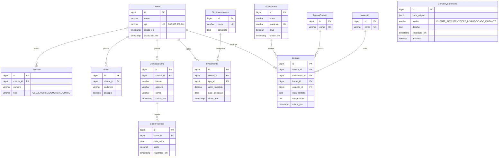

# Modelo de Dados em 3FN — Sistema XPTO Investimentos

## Diagrama Entidade-Relacionamento (Mermaid)

---

## Justificativa da Normalização até a 3FN

1. **Primeira Forma Normal (1FN)**:
   - Eliminação de atributos multivalorados em uma única célula: telefones e e-mails foram extraídos para tabelas próprias (`Telefone` e `Email`), com 1 registro por linha.
   - O saldo bancário deixou de ser uma coluna fixa em cliente e passou para o histórico (`SaldoHistorico`).

2. **Segunda Forma Normal (2FN)**:
   - Todos os atributos não-chave dependem da chave primária inteira de cada entidade.

3. **Terceira Forma Normal (3FN)**:
   - Eliminação de dependências transitivas: dados de domínio (`TipoInvestimento`, `FormaContato`, `Assunto`, `Funcionario`) foram isolados em tabelas próprias referenciadas por chaves estrangeiras.
